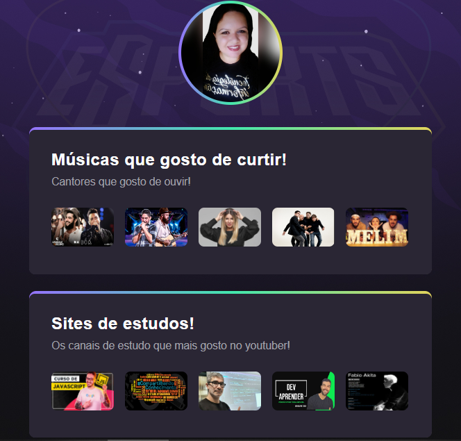

# 🚀 Agregador de Links 

## Sobre o projeto
💜 NLW eSports-Stage  💜 </br>
Projeto criado durante o evento da NLW eSports-Stage , trilha explorer do Rockseat 
</br>

<p>
Page web com os links de músicas, jogos, sites de estudos, ou qualquer coisa que você mais goste... tudo agregado para poder compartilhar com quem quiser.
</p>

## Layout do projeto
<div>
<p align="heigth">
           
    
</p>
</div>

## Tecnologias usadas
<li> Html 
<li> Css 
<li> Figma
<li> Visual Studio Code
<li> Extensão do vsc "Live Server"

</br>

## Como executar o programa 
```bash
git clone git@github.com:alinenog/Cracha-Nlw.git

```
### Autora
Aline Nogueir@ 👩🏻‍💻
